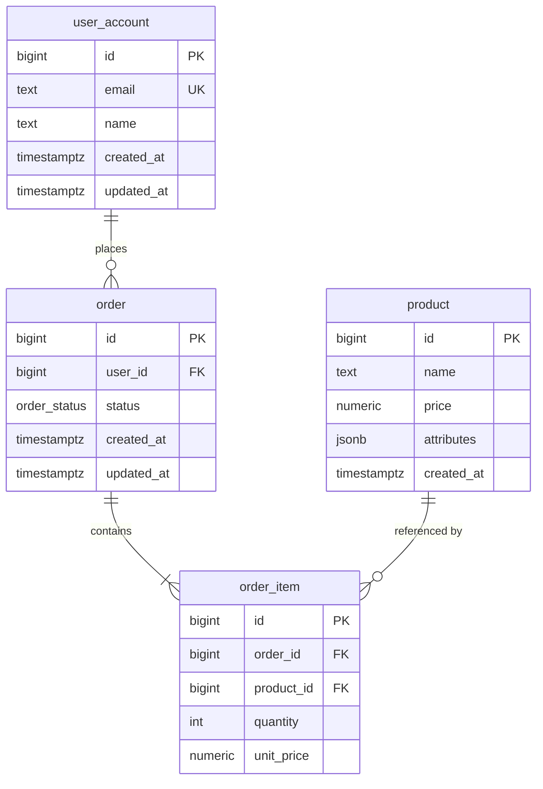

# Mermaid ERD Quick Reference

Use this syntax when producing the ERD output file (`docs/erd.mermaid`).

## Basic Structure



## Relationship Cardinality

```
||--||   exactly one to exactly one
||--o{   exactly one to zero or more
||--|{   exactly one to one or more
o|--o{   zero or one to zero or more
```

Read left to right: left side of `--` describes left entity, right side describes right entity.

| Symbol | Meaning |
|--------|---------|
| `\|\|` | exactly one |
| `o\|` | zero or one |
| `\|{` | one or more |
| `o{` | zero or more |

## Column Markers

| Marker | Meaning |
|--------|---------|
| `PK` | Primary Key |
| `FK` | Foreign Key |
| `UK` | Unique Key |

## Rules for This Skill

1. Use PostgreSQL type names as column types (bigint, text, timestamptz, numeric, jsonb)
2. Quote table names that are reserved words (`"order"`, `"user"`)
3. Include PK, FK, UK markers
4. Keep relationship labels short (verb phrases: "places", "contains", "belongs to")
5. Group related tables visually — Mermaid renders top-to-bottom by default
6. For large schemas (15+ tables), split into logical groupings with comments
